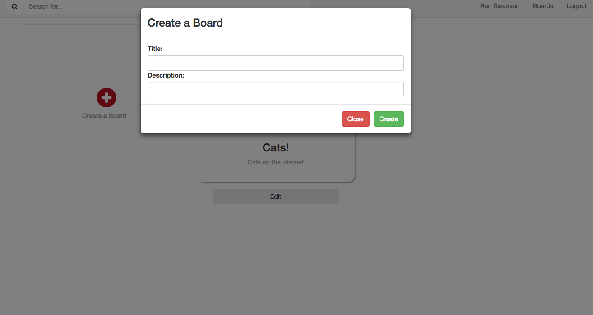
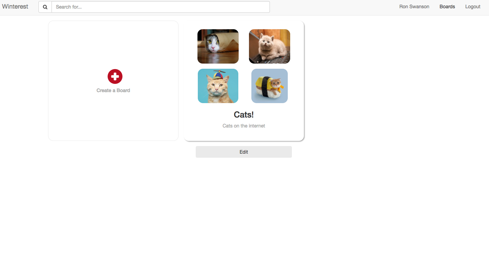
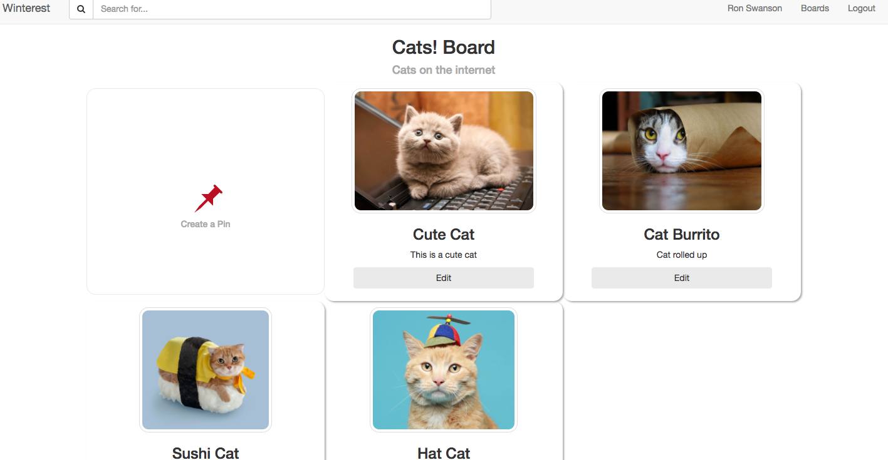

# Winterest (Pinterest clone)

Hosted version here: [Winterest](https://daynewright.github.io/winterest/)

This is a simple clone of Pinterest using [Angular](https://angularjs.org/) and [Firebase](https://firebase.google.com/). It was built by Dayne Wright, Matt Hamil, Grant Regnier and Delaine Wendling.

## Technologies

Angular | FireBase | SASS | Grunt | Bower | NPM

## Overview

A quick overview of the user experience with in the application.

### Login

The application has user authentication through Firebase.  You are able to login with a Google account or create on with an email and password.

### Creating Boards

You are then able to create boards with a title and description where you will place a collection of pins.  You can search, delete and update boards that you have created.

### Board View

After you add a board you can then create pins for that board.  You need an image link, title and description.  The top four pins are used for the main images on the board view.

### Adding & Deleting Pins

Once pins are made you can drag and drop to sort and click edit to change any details on that specific pin.

